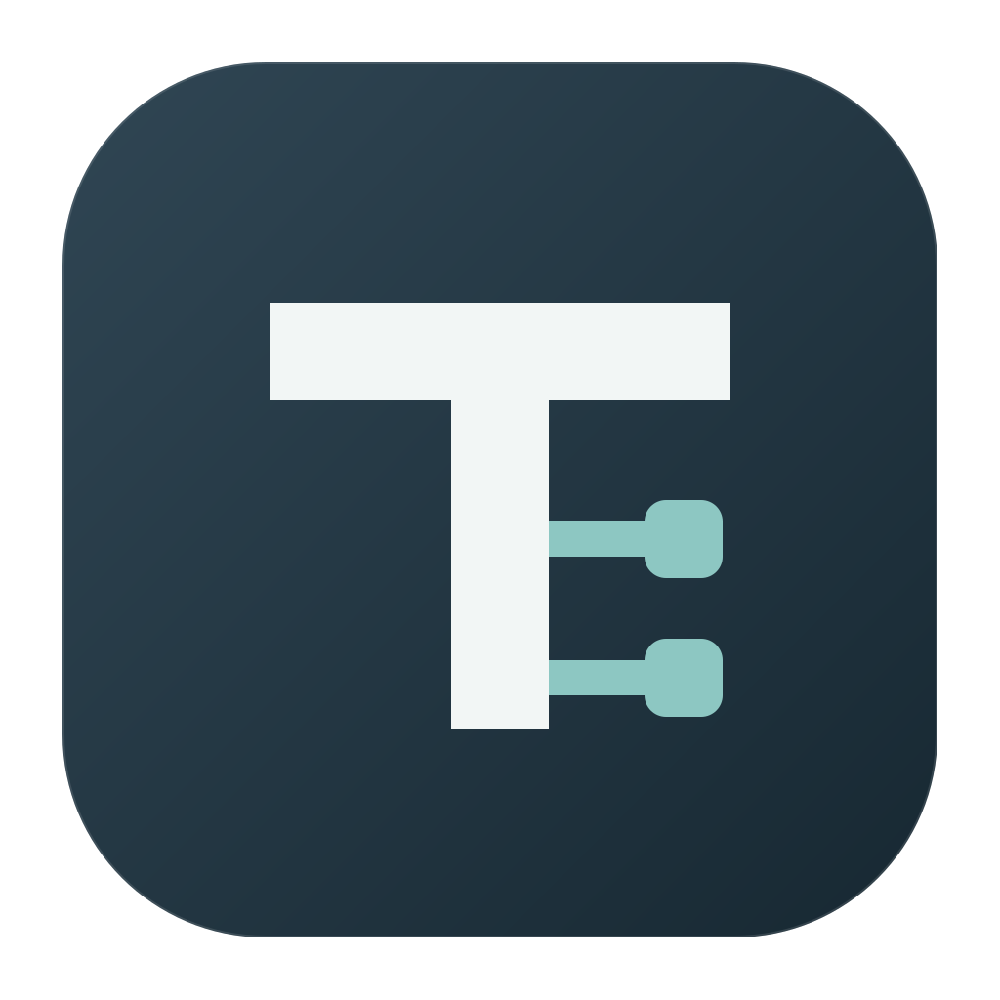
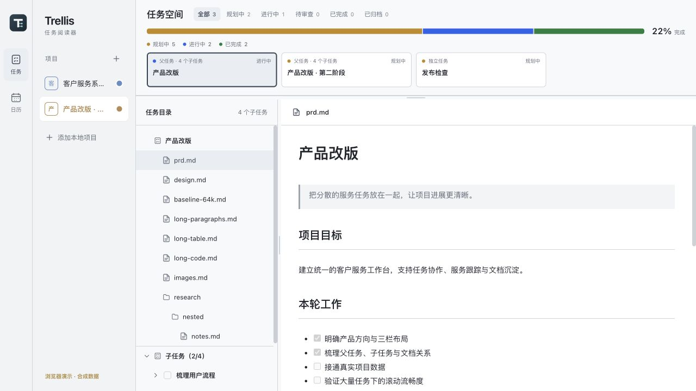
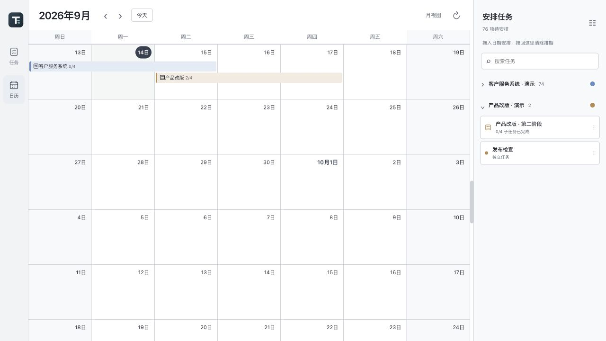

# Trellis Viewer

**把 Trellis 的任务、文档和排期放到一个窗口里。**

一个面向 macOS 的本地任务阅读与排期工具。切换多个项目，查看父子任务和 Markdown 文档，再用月历安排计划。源项目只读，配色与排期由应用独立保存。

[下载 macOS 试用版](https://github.com/whaat1/trellis-viewer/releases/latest) · [安装说明](docs/installation.md) · [反馈问题](https://github.com/whaat1/trellis-viewer/issues)

## 能做什么

- **集中阅读**：状态筛选、父子任务目录、Markdown 正文与自动刷新。
- **看清进展**：子任务完成情况、项目状态分布和完成度；父任务作为分组，不重复计入执行任务数量。
- **安排计划**：跨项目月历，拖动任务安排日期、拖边缘调整天数、拖回右侧清除排期。
- **按项目区分**：自定义项目颜色，日历沿用对应颜色。
- **保留阅读习惯**：拖动分隔线调整布局，记住阅读位置。

上图使用合成演示数据，不含真实项目资料。

## 下载与上手

首版提供 **macOS Apple Silicon（M 系列芯片）DMG**，最低系统配置为 macOS 12，主要在 macOS 26 上验证。Intel、Windows 和 Linux 暂未提供经过验证的发行包。

1. 从 [Releases](https://github.com/whaat1/trellis-viewer/releases/latest) 下载 DMG，把应用拖到 Applications。
2. 打开应用，添加包含 `.trellis/tasks` 的项目根目录。
3. 选择任务阅读文档，或切换日历安排计划。

**当前安装包尚未经过 Apple 公证。** 首次启动可能被 macOS 拦截，处理方式和校验方法见 [安装说明](docs/installation.md)。不需要 App Store，也不需要安装 Rust 或 Node.js 来运行下载的应用。

没有现成项目？下载源码后，导入 [examples/sample-project](examples/sample-project) 即可体验。

## 数据留在哪里

导入项目只读：不修改任务状态、不归档任务、不执行项目脚本、不安装 Agent Hook。项目登记、配色和计划保存在应用自己的 `~/Library/Application Support/local.trellis.viewer/` 目录；界面偏好由本地 WebView 保存。任务内容无需上传服务端。

月历安排的是顶层父任务和独立任务；进度统计按末级执行任务计算，包含归档、排除取消，父任务不重复计数。

## 当前边界

这是 `0.1.0` 公开试用版。图片预览、外链打开、自动更新、跨设备排期同步、项目移除入口和任务主视图搜索暂未提供。日历的待安排列表支持搜索。完整的大规模原生性能验收尚未完成。

后续优先考虑项目管理入口、任务搜索和文档图片预览，欢迎反馈实际使用场景。

## 开发与贡献

技术栈：Tauri 2、Rust、React、TypeScript、FullCalendar Standard。

构建、测试、DMG 发布和代码结构见 [开发说明](docs/development.md)。反馈与贡献方式见 [CONTRIBUTING.md](CONTRIBUTING.md)。

## 许可与致谢

本项目使用 [MIT License](LICENSE)。第三方组件保留各自许可证，详见 [THIRD_PARTY_NOTICES.md](THIRD_PARTY_NOTICES.md)。

这是围绕 Trellis 工作流开发的独立社区工具。感谢 [trellis-card](https://github.com/czm15053/trellis-card) 提供的产品灵感；本项目独立实现任务阅读与排期功能，参考仓库不参与构建。

社区友链：[LINUX DO](https://linux.do/) — 感谢社区提供开源作品交流与分享的平台。
